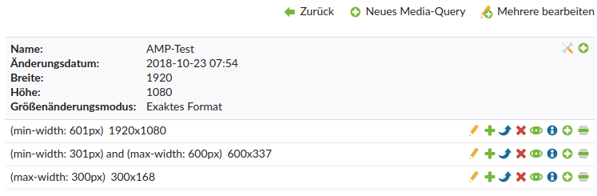

# Contao AMP Bundle

This bundle offers functionality concerning [Accelerated Mobile Pages (AMP)](https://www.ampproject.org) for the Contao CMS.


## Features

- offer an alternative AMP version for an ordinary Contao page (GET-Parameter `amp=1` must be set)
- offer AMP templates for the supported content elements and modules
- custom inline CSS can be added via...
    - static file
    - webpack/encore integration via [heimrichhannot/contao-encore-bundle](https://github.com/heimrichhannot/contao-encore-bundle)
    - manually in fe_page_amp.html5


## Setup

### Installation

Install via composer: `composer require heimrichhannot/contao-amp-bundle` and update your database.

### First steps

1. Create an ordinary layout and assign `fe_page_amp.html5` as template. Click `Add AMP support`.
1. Navigation to the root page where you want to add AMP support, set AMP support to active and choose the layout created in step 1.
1. In order to show your website in AMP mode simply append the GET parameter `amp=1` to your URL, i.e. `https://www.example.org/article` → `https://www.example.org/article?amp=1`


## Usage

### Menu/Navigation

This bundle comes with an custom frontend module for navigation. It renders the menu as sidebar and add the option to render sub pages as accordions. We recommend to use it for the navigation on your amp page.   
Since amp-sidebar must sit directly within the body element, put the navigation module into the header section of your template (we removed container elements for header section in our template).

### Support custom templates

1. Add the template to your bundle/project configuration. If your template should use amp components, add them 

    ```yaml
    huh_amp:
      templates:
        ce_my_content_element:
          components: ['accordion','youtube']
    ```
    
1. Create an amp template for this template and give it an _amp prefix (e.g. `ce_my_content_element_amp`)

If you need more control, use the [`PrepareAmpTemplateEvent`](#events). If the template will be only used in amp context, you can set `ampTemplate` to true, see [configuration](#configuration) section.

## Developers

### Events

Class | Name | Description
----- | ---- | -----------
PrepareAmpTemplateEvent | huh.amp.event.prepare_amp_template | Prepare template, add/change amp components, change the template name.


### Supported content elements

Contao content element | Contao template | AMP component | AMP template | Notes
---------------------- | --------------- | ------------- | ------------ | -----
`ContentAccordion` | `ce_accordionSingle.html5` | accordion | `ce_accordionSingle_amp.html.twig` | single element accordions
`ContentAccordionStart` | `ce_accordionStart.html5` | accordion | `ce_accordionStart_amp.html.twig` |
`ContentAccordionStop` | `ce_accordionStop.html5` | accordion | `ce_accordionStop_amp.html.twig` |
`ContentImage` | `ce_image.html5` | image | `ce_image_amp.html.twig` |
`ContentMedia` | `ce_player.html5` | audio or video | `ce_player_amp.html.twig` | aka "Audio/Video"; if `isVideo` is set in the template, the amp component "video" is used
`ContentYouTube` | `ce_youtube.html5` | youtube | `ce_youtube_amp.html.twig` or `ce_youtube_amp_huh.html.twig` | core content element or [heimrichhannot/contao-youtube-bundle](https://github.com/heimrichhannot/contao-youtube-bundle)
`ContentSlick` | `ce_slick.html5` | carousel | `ce_slick_amp.html.twig` | [heimrichhannot/contao-slick-bundle](https://github.com/heimrichhannot/contao-slick-bundle)

### Supported modules

Contao module | Contao template | AMP component | AMP template | Notes
---------------------- | --------------- | ------------- | ------------ | -----
`ModuleNavigation` | `mod_navigation.html5` | sidebar + accordion | `mod_navigation_amp.html.twig` |

### AMP Validation

You can validate your AMP page by appending `#development=1` to your url.

Things to consider:

- If you do that in dev mode (by using `app_dev.php`), you'll get validation errors concerning the position of custom CSS tag and that custom JS is not allowed. Both of the errors are due to the symfony debug toolbar and should disappear in production mode.
- When developing a website you might do that in localhost or some kind of custom domain. So you can ignore the error "The attribute 'href' in tag 'base' is set to the invalid value [...]" becuase in production mode it will disappear.
- Take care of your generated CSS: it shouldn't contain any source map files, because these will significantly increase the size of the CSS

### Meta-Tag handling in fe_page

The meta tags are handled using [heimrichhannot/contao-head-bundle](https://github.com/heimrichhannot/contao-head-bundle) and rendered as follows:

```
<?php $this->block('meta'); ?>
    <?= $this->meta; ?>
<?php $this->endblock(); ?>
```

*Hint: If you use `fe_page_amp.html5` in your AMP layout, you won't have to take care of this.*

### Override templates

#### HTML5 templates

These can be overridden as usual by putting a file with the same name into your project's `templates` directory or in the `templates` directory of one of your modules.

#### Twig templates

These can be overridden by putting a file with the same name into your project's `app/Resources/views` directory or in the `src/Resources/views` directory of one of
your bundles (these bundles must load after the `contao-amp-bundle`; you can specify this in your bundle's `Plugin.php`).

### Responsive images: Contao vs. AMP

Keep in mind: If you didn't specify image sizes in Contao, you can skip this chapter.

In Contao responsive images are built with "archives" (`tl_image_size` and `tl_image_size_item`). In tl_image_size you can define a default
image size and in `tl_image_size_item` instances more sizes depending on a given media query.

In AMP on the other hand there's no such thing as a default case, so you need to create it **explicitly**. Also you have to add media-queries for
each and every `tl_image_size_item` so that you don't have duplicates.

So you have 2 options:

1. Assign an image size with **no** child elements to your image, i.e. only `tl_image_size`.
2. Create `tl_image_size_item` instances so that you have one for every situation that can happen. Example:



### SVG images

If you use svg-images ensure that they have assigned `width` and `height` attributes on the `<svg>` element. Otherwise they wont have dimensions in their amp-version and the lazy loading component requires width and height for aspect ratio padding.

For non-amp version simply add the following css rules and attach `.img-fluid` css class to make svg responsive again:

```
.img-fluid {
    max-width: 100%;
    height: auto;
}
```

### Usage with heimrichhannot/contao-encore-bundle

This bundle supports the integration of webpack encore using [heimrichhannot/contao-encore-bundle](https://github.com/heimrichhannot/contao-encore-bundle).

For this you can simply add a new webpack entry in your `config.yml` as you would normally within `contao-encore-bundle` and assign it to your AMP layout.

The code in the generated file then automatically gets rendered to the `<style amp-custom>` element. Simple as that :-)

### Configuration

```yaml
# src/Ressources/config/config.yml
huh_amp:
  # Add support for additional templates
  templates:
    my_custom_template:
      components: ['accordion','youtube'] # amp components needed for this template
      ampTemplate: false # set to true, if the template is already prepared for amp (don't add a _amp suffix)
    # Examples:
    ce_youtube:
      components: ['youtube']
    mod_ampnavigation:
      components: ['sidebar','accordion']
      ampTemplate: true
    cookiebar: ~
  # Add support for additional amp components
  components:
    accordion: { url: "https://cdn.ampproject.org/v0/amp-accordion-0.1.js" }
    sidebar:   { url: "https://cdn.ampproject.org/v0/amp-sidebar-0.1.js" }
    youtube:   { url: "https://cdn.ampproject.org/v0/amp-youtube-0.1.js" }
```

## Known limitations

- currently AMP pages without a non-AMP layout are not supported